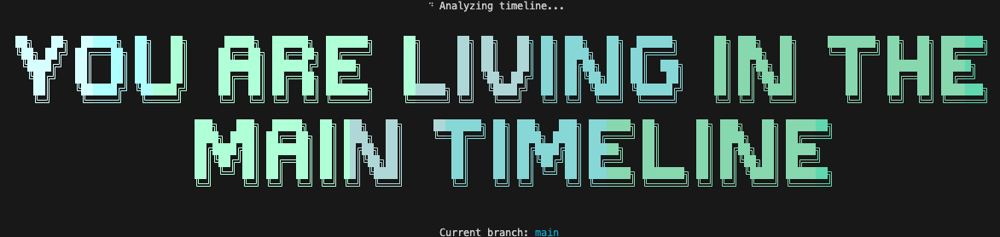
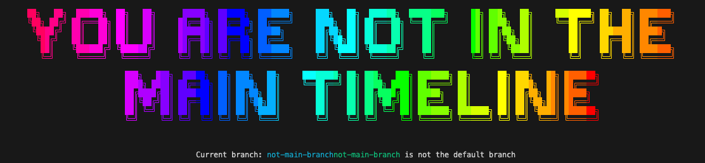

# which-git-timeline

[](https://choosealicense.com/licenses/mit/)
[](https://nodejs.org)
[](https://github.com/vadimdemedes/ink)
[](https://youtu.be/0N87f5wfxr0?si=SNpX7prOQjxjqPxB&t=29)

🕰️ Are you in the main timeline? Let's find out! 

This fun little CLI app uses the power of React in your terminal to tell you if you're on the main timeline (default branch) or if you've branched off into an alternate reality.

## ✨ Features

- Beautiful terminal UI built with React-like component development experience
- Instant timeline verification
- No Future Gadget No. 8 required!

## 🛠️ Tech Stack

- [Ink](https://github.com/vadimdemedes/ink) - React for CLI apps
- React - Component-based UI
- TypeScript - Type safety across timelines
- Node.js child_process - For git branch detection

## 🚀 Getting Started

1. Start the development server:
```bash
npm run dev
```

2. In a separate terminal, run:
```bash
which-git-timeline
```

You either get a message that you're in the main timeline

[](./docs/assets/main-timeline.png)

**or** that you're not.

[](./docs/assets/alternate-timeline.png)

## 🎬 Inspiration

Got the idea after watching that cool Watch App for time travelling: [Watch the clip](https://youtu.be/0N87f5wfxr0?si=SNpX7prOQjxjqPxB&t=29)
